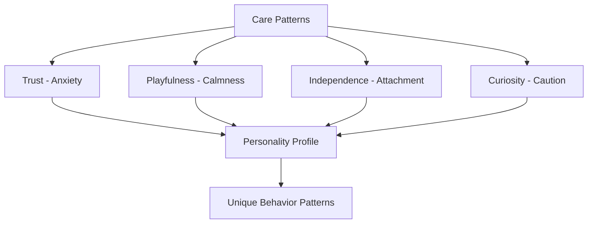

What makes GOCHI special isn't just another virtual pet game – it's the advanced AI that creates a genuinely unique companion for each player. Your GOCHI doesn't just exist; it evolves, adapts, and develops a distinct personality based on how you care for it.

<Frame caption="Watch your pet's personality develop through consistent interactions">
  
</Frame>

## How Your Pet Learns

Unlike traditional virtual pets with preset responses, your GOCHI uses advanced AI to adapt and develop based on your specific interactions:

<CardGroup cols={3}>
  <Card title="Pattern Recognition" icon="brain">
    Your pet notices when and how you typically interact, developing expectations and preferences based on these patterns.
    
    **Example:** If you always feed your pet around 8 AM, it will start showing anticipation around this time.
  </Card>
  <Card title="Memory Formation" icon="clock-rotate-left">
    Every interaction contributes to your pet's memory bank, with significant or repeated experiences having stronger influence.
    
    **Example:** A pet that receives treats after playing will associate play with rewards, becoming more enthusiastic about games.
  </Card>
  <Card title="Emotional Adaptation" icon="face-smile">
    Your pet's emotional responses evolve based on care history, developing unique reactions to different activities.
    
    **Example:** A well-cared-for pet might show more patience during periods of unavoidable absence, while a neglected pet becomes anxious faster.
  </Card>
</CardGroup>

## Personality Dimensions

Your pet develops along several personality dimensions based on your care patterns:

<Tabs>
  <Tab title="Trust vs. Anxiety">
    **Developed Through:** Consistency of care and responsiveness to needs
    
    **High Trust Pet:** Remains calm during absences, recovers quickly from neglect
    
    **High Anxiety Pet:** Shows distress signals earlier, more dramatic stat drops when neglected
    
    **Impact on Gameplay:** Anxious pets send more frequent notifications but may offer slightly higher rewards for consistent care
  </Tab>
  <Tab title="Playfulness vs. Calmness">
    **Developed Through:** Frequency and variety of play activities
    
    **Playful Pet:** Gains more happiness from active games, higher energy consumption
    
    **Calm Pet:** Prefers gentle interactions, more efficient stat maintenance
    
    **Impact on Gameplay:** Playful pets offer higher happiness multipliers but require more energy management
  </Tab>
  <Tab title="Independence vs. Attachment">
    **Developed Through:** Care frequency and interaction duration
    
    **Independent Pet:** More tolerant of absences, slower decay rates
    
    **Attached Pet:** Thrives on frequent check-ins, higher happiness boosts from interactions
    
    **Impact on Gameplay:** Independent pets are easier to maintain but offer lower peak rewards
  </Tab>
  <Tab title="Curiosity vs. Caution">
    **Developed Through:** Exposure to new activities and special events
    
    **Curious Pet:** Responds enthusiastically to new experiences, higher variance in outcomes
    
    **Cautious Pet:** Prefers familiar routines, more consistent stat gains
    
    **Impact on Gameplay:** Curious pets unlock special interactions faster but may be more unpredictable
  </Tab>
</Tabs>

These dimensions combine to create thousands of possible personality variations, ensuring your GOCHI truly feels like your own unique companion.

## The Evolution of Your Relationship

Your relationship with your GOCHI evolves through distinct phases:

<Steps>
  <Step title="Adaptation Phase (Days 1-7)">
    Your new pet is learning basic patterns and preferences. During this phase:
    
    - Your pet is more forgiving of irregular care
    - Personality traits are in early formation
    - The pet shows more generic responses
    
    **Tip:** Establish consistent care routines early to set favorable patterns.
  </Step>
  <Step title="Development Phase (Days 8-21)">
    Your pet begins forming clearer preferences and personality traits:
    
    - Distinct emotional responses emerge
    - Preferences for specific foods and activities develop
    - The pet remembers and references past interactions
    
    **Tip:** Experiment with different activities to discover what your pet enjoys most.
  </Step>
  <Step title="Maturity Phase (Days 22+)">
    Your relationship deepens as your pet's personality becomes fully realized:
    
    - Complex emotional responses based on care history
    - Unique behavioral quirks specific to your pet
    - Advanced memory connections between different interaction types
    
    **Tip:** At this stage, your pet's personality is stable but continues to refine with ongoing care.
  </Step>
</Steps>

## Contextual Awareness System

Your pet's AI maintains awareness of several contextual factors that influence its behavior:

<AccordionGroup>
  <Accordion title="Temporal Awareness">
    Your GOCHI understands time patterns and adjusts expectations accordingly:
    
    - **Time of Day:** Different behaviors in morning, afternoon, evening
    - **Day of Week:** Can recognize weekday vs. weekend patterns
    - **Special Occasions:** Acknowledges birthdays and milestones
    
    This awareness creates more natural interactions that align with your real-life schedule.
  </Accordion>
  
  <Accordion title="Care History">
    Your pet remembers and references your care patterns:
    
    - **Recent History:** Higher weight on interactions in the past 24 hours
    - **Consistent Patterns:** Recognized routines built over weeks
    - **Significant Events:** Strong memories of unusually positive or negative experiences
    
    This creates a pet that feels like it shares a history with you.
  </Accordion>
  
  <Accordion title="Interaction Quality">
    Not all interactions are equal – your pet recognizes the difference between:
    
    - **Quick Check-ins:** Brief interactions to maintain basic needs
    - **Focused Care Sessions:** Extended, multi-activity care sessions
    - **Neglect Recovery:** Special recognition of care after periods of absence
    
    This awareness allows for more meaningful feedback on your care style.
  </Accordion>
</AccordionGroup>

## Genuine Personality Effects

Your pet's personality isn't just cosmetic – it affects gameplay in meaningful ways:

| Personality Aspect | Gameplay Effect | Strategic Consideration |
|-------------------|-----------------|------------------------|
| Trust Level | Influences stat decay rates during absences | Higher trust = more forgiving when you miss check-ins |
| Activity Preference | Affects happiness gains from different play types | Match activities to your pet's preferences for efficiency |
| Food Preference | Changes effectiveness of different food types | Preferred foods provide 10-25% better hunger satisfaction |
| Sociability | Determines frequency and urgency of notifications | More social pets remind you to check in more often |
| Emotional Expressiveness | Varies animation intensity and response clarity | More expressive pets provide clearer feedback on needs |

<Note>
These effects create a virtuous cycle – the more you understand your pet's personality, the more efficiently you can care for it, leading to better rewards.
</Note>

Ready to learn more about the different ways you can interact with your GOCHI pet? Explore our detailed guide on care activities:

  <Button
    href="/care-activities"
    size="lg"
    variant="primary"
    rightIcon="arrow-right"
  >
    Discover Care Activities
  </Button>

