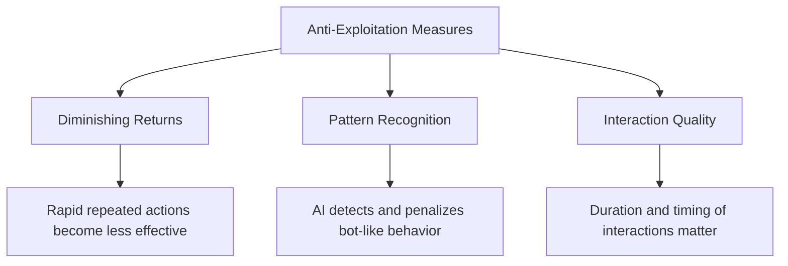

GOCHI's core innovation is its care-to-earn model, which rewards players for providing quality care to their virtual companions. Unlike traditional play-to-earn games that often rely on grinding repetitive tasks, GOCHI creates value through meaningful interaction and consistent engagement.

## Care Quality Score

The foundation of GOCHI's reward system is the Care Quality Score—a comprehensive metric that evaluates how well you're caring for your pet.

### Score Components

<Frame>
  
</Frame>

Your Care Quality Score is a weighted average of four key factors:

| Component | Weight | Description |
|-----------|--------|-------------|
| Stat Averages | 40% | Average of hunger, happiness, cleanliness, and energy stats |
| Interaction Frequency | 30% | How regularly you check in and care for your pet |
| Stat Stability | 20% | How well you maintain stats above critical thresholds |
| Interaction Variety | 10% | Diversity of care activities you perform |

### How It's Calculated

The GOCHI system uses this formula to determine your score:

```javascript
// Simplified representation of how Care Quality is calculated
Score = (StatAverage × 0.4) + 
        (InteractionFrequency × 0.3) + 
        (StatStability × 0.2) + 
        (InteractionVariety × 0.1)
```

This approach rewards balanced care that maintains high stats, regular check-ins, and varied activities.

## Earning Tiers

Your Care Quality Score determines your base earning rate:

| Care Quality | Score Range | Multiplier | Requirements |
|--------------|-------------|------------|--------------|
| Excellent | 90-100 | 3.0× | All stats above 90%, optimal interaction frequency and variety |
| Good | 70-89 | 2.0× | All stats above 70%, regular interactions |
| Average | 50-69 | 1.0× | All stats above 50%, basic care routine |
| Poor | 30-49 | 0.5× | One or more stats below 50% |
| Critical | 0-29 | 0.1× | One or more stats below 30% |

<Note>
These multipliers apply to your base earning rate before token holding bonuses are calculated. The combined effect of excellent care and substantial token holdings creates a powerful earning opportunity.
</Note>

## Optimization Strategies

<AccordionGroup>
  <Accordion title="Stat Management">
    - Focus on hunger first (highest weight and fastest decay)
    - Maintain all stats above 70% for optimal scoring
    - Address stats before they fall below critical thresholds
    - Use premium foods strategically before longer absences
  </Accordion>
  
  <Accordion title="Interaction Planning">
    - Aim for 8-10 interactions during your pet's active period
    - Space interactions throughout the day rather than clustering them
    - Use varied care activities rather than repeating the same ones
    - Activate Sleep Mode before extended absences
  </Accordion>
  
  <Accordion title="Advanced Techniques">
    - Build care streaks by interacting at similar times each day
    - Combine token holding with excellent care for maximum returns
    - Learn your pet's personality preferences to optimize happiness gains
    - Use the "care cascade" approach: multiple short sessions spaced 1-2 hours apart
  </Accordion>
</AccordionGroup>

## Anti-Exploitation Measures

GOCHI is designed to reward genuine, thoughtful care rather than mechanical interactions or exploitation.



<Warning>
Attempts to automate interactions or use bot-like patterns of care will be detected by the AI system and result in reduced earnings. The system is designed to recognize and reward authentic care patterns that mirror real pet care.
</Warning>
