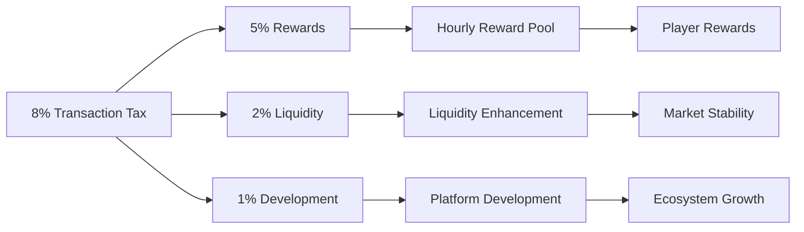

GOCHI's economic model is designed for long-term sustainability, balancing player rewards with ecosystem health through a carefully structured tax system and token utility.

## Tax Structure

The foundation of GOCHI's economic model is the 8% transaction tax applied to all $PURR token purchases and sales:

<CardGroup cols={3}>
  <Card title="5% to Rewards" icon="sack-dollar">
    Directly funds the SOL rewards distributed to active players through the hourly reward system.
  </Card>
  <Card title="2% to Liquidity" icon="water">
    Automatically enhances market stability by adding to liquidity pools, reducing slippage and price impact.
  </Card>
  <Card title="1% to Development" icon="wrench">
    Supports ongoing platform improvements, marketing initiatives, and operational costs.
  </Card>
</CardGroup>



<Note>
This tax structure creates a self-sustaining ecosystem where player activities directly fund rewards, while ensuring sufficient resources for platform growth and market stability.
</Note>

## Sustainability Mechanics

Several mechanisms work together to ensure GOCHI's economic sustainability:

<AccordionGroup>
  <Accordion title="Volume-Based Rewards">
    The reward system scales automatically with trading volume:
    
    ```
    Daily Reward Pool = Daily Trading Volume × 0.05
    ```
    
    This ensures that rewards remain proportional to ecosystem activity without requiring external funding or unsustainable emission rates.
  </Accordion>
  
  <Accordion title="Token Utility & Sinks">
    $PURR token has meaningful utility beyond speculation:
    
    - **Holding Multiplier:** Creates demand for accumulating and holding tokens
    - **Pet Creation:** Tokens used for creation are burned, decreasing supply
    - **Premium Features:** Provides ongoing utility for token spending
    
    These utilities create natural token sinks that help maintain price stability.
  </Accordion>
  
  <Accordion title="Anti-Whale Measures">
    While the holding multiplier benefits larger holders, several measures prevent excessive advantage:
    
    - Power function (0.7 exponent) creates diminishing returns
    - 8.0× maximum multiplier creates a reasonable ceiling
    - Care quality remains essential even for whales
    
    This balanced approach rewards investment while maintaining gameplay importance.
  </Accordion>
</AccordionGroup>

## Volume Requirements

The sustainability of GOCHI's reward system depends on maintaining healthy trading volume:

| Daily Volume | Daily Rewards | Monthly Rewards | Sustainability Assessment |
|--------------|--------------|----------------|---------------------------|
| $1M | $50,000 | $1.5M | Minimal viable operation |
| $5M | $250,000 | $7.5M | Target healthy ecosystem |
| $10M+ | $500,000+ | $15M+ | Thriving ecosystem |

<Warning>
For long-term sustainability, minimum daily volume should be at least 20× the daily reward distribution. This ensures sufficient funding for rewards while maintaining market liquidity and development resources.
</Warning>

## Economic Phases

GOCHI's economy is designed to evolve through several phases:

<Steps>
  <Step title="Launch Phase (Months 1-3)">
    - Initial token distribution through points conversion
    - High early trading volume and volatility
    - Generous initial rewards to drive adoption
    - Focus on building user base and engagement
  </Step>
  
  <Step title="Growth Phase (Months 4-9)">
    - Stabilizing token price with increasing utility
    - Expanding player base with more distributed token holdings
    - Normalized reward distribution as player base grows
    - Introduction of additional utility features
  </Step>
  
  <Step title="Maturity Phase (Month 10+)">
    - Stable, sustainable economy with predictable rewards
    - Balanced token distribution across player segments
    - Deep liquidity and reduced price volatility
    - Community governance beginning to play larger role
  </Step>
</Steps>

## Token Velocity Management

Managing token velocity (how quickly tokens change hands) is crucial for long-term economic health:

<CardGroup cols={2}>
  <Card title="Velocity Reduction" icon="hourglass-half">
    - Holding multiplier incentivizes keeping tokens rather than trading
    - Pet creation burns create permanent supply reduction
    - Vesting schedules for team and advisor tokens prevent early selling
  </Card>
  
  <Card title="Healthy Circulation" icon="circle-nodes">
    - Premium features encourage some token utilization
    - Trading activity generates tax revenue for rewards
    - Balanced approach allows for both holding and utility
  </Card>
</CardGroup>

## Risk Management

<AccordionGroup>
  <Accordion title="Market Volatility Protection">
    During periods of extreme market volatility:
    
    - Treasury reserves can temporarily supplement reward pool
    - Dynamic adjustment of reward calculation ensures fairness
    - Incentive programs can boost activity during low-volume periods
  </Accordion>
  
  <Accordion title="Player Base Fluctuations">
    As player counts vary:
    
    - Per-player rewards adjust automatically through the reward formula
    - Early adopter advantages create natural retention
    - Progressive holding multipliers benefit long-term community members
  </Accordion>
</AccordionGroup>

<Tip>
GOCHI's economic model differs from many blockchain games by rewarding in SOL rather than the native token. This reduces sell pressure on $PURR while providing immediate, tangible value to players in an established cryptocurrency.
</Tip>