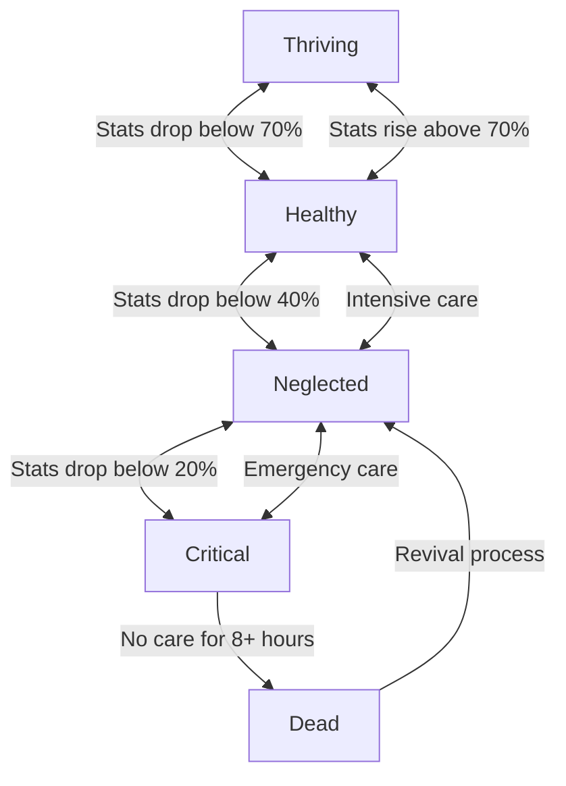

Your GOCHI pet's health is dynamic, changing in response to your care patterns and directly impacting your earning potential. Learning to recognize different health states and how to address them is essential for maximizing your rewards.

<Frame caption="Your pet's status dashboard provides a real-time view of its current health state">
  
</Frame>

## Health State Transitions

Your pet's health state changes based on your care patterns and neglect periods:

<Note>
Movement between states is not instantaneous - your pet gradually transitions as stats change. You'll receive notifications as your pet approaches negative state changes, giving you time to intervene.
</Note>

## Warning Signs to Watch For

Learn to recognize these early warnings to prevent serious health deterioration:

<CardGroup cols={3}>
  <Card title="Appetite Changes" icon="drumstick-bite">
    If your pet becomes hungry more quickly than usual, it may indicate a developing health issue.
    
    **Watch for:** Hunger decreasing 10-15% faster than normal
    
    **Action:** Increase feeding frequency and monitor for improvement
  </Card>
  
  <Card title="Activity Reduction" icon="battery-half">
    Decreased energy and lower interest in play activities often precede health problems.
    
    **Watch for:** Reduced animation speed and less enthusiastic play responses
    
    **Action:** Provide balanced care with focus on maintaining high happiness
  </Card>
  
  <Card title="Visual Changes" icon="eye">
    Your pet's appearance provides important health cues.
    
    **Watch for:** Color dulling, posture changes, or unusual animations
    
    **Action:** Provide comprehensive care across all stats
  </Card>
</CardGroup>

## Health Emergencies

<Warning>
Health emergencies require immediate attention to prevent serious stat penalties and extended earning reductions!
</Warning>

### Critical State Management

When your pet enters a critical state (any stat below 20%):

<Steps>
  <Step title="Assess Critical Stats">
    Identify which stats have fallen below critical thresholds
  </Step>
  <Step title="Address Hunger First">
    Always address hunger first - use Premium Cat Food for fastest recovery
  </Step>
  <Step title="Restore Happiness">
    Once hunger is addressed, focus on happiness recovery
  </Step>
  <Step title="Complete Care Cycle">
    Perform a full care cycle (feed, play, clean) to stabilize all stats
  </Step>
  <Step title="Increase Check-in Frequency">
    Double your check-in frequency for the next 24 hours
  </Step>
</Steps>

## The Revival Process

If your pet reaches the death state, you'll need to complete the revival process to resume earning:

<Frame caption="The revival interface guides you through the recovery process">
  
</Frame>

<AccordionGroup>
  <Accordion title="Revival Initiation">
    When you access the app with a pet in the death state:
    
    - You'll see a recovery interface instead of the normal pet screen
    - The system will explain the revival process
    - You'll need to acknowledge the care commitment before proceeding
    
    **Important:** The revival process cannot be skipped or accelerated
  </Accordion>
  
  <Accordion title="Care Commitment">
    To begin revival, you must commit to:
    
    - Checking in at least 6 times in the next 24 hours
    - Maintaining all stats above 40% during recovery
    - Completing the full revival protocol without extended absences
    
    This commitment helps ensure you're ready to provide the necessary care.
  </Accordion>
  
  <Accordion title="Recovery Protocol">
    The recovery involves several care cycles:
    
    1. **Initial Stabilization:** First feeding and care cycle
    2. **Waiting Period:** 1-hour observation with stats frozen
    3. **Secondary Care:** Second complete care cycle
    4. **Monitoring Period:** 4-hour period maintaining all stats above 40%
    5. **Final Assessment:** Final care cycle and system evaluation
    
    If any step fails, the process restarts from the previous checkpoint.
  </Accordion>
  
  <Accordion title="Post-Revival Effects">
    After successful revival:
    
    - Your pet returns with all stats at 50%
    - Decay rates increase by 20% for the next 48 hours
    - A "Recovering" indicator appears in the interface
    - Maximum earnings are capped at 2.0× for one week
    
    These effects ensure that death has meaningful consequences while still allowing full recovery.
  </Accordion>
</AccordionGroup>

<Tip>
Consistency beats intensity! Regular moderate care will keep your pet healthier than sporadic intensive care. Aim for evenly spaced interactions rather than clustering care into single sessions.
</Tip>

## Health History Impact

Your pet's health history affects both its personality development and long-term traits:

| Health Pattern | Personality Impact | Stat Effects | Economic Impact |
|----------------|-------------------|--------------|-----------------|
| Consistently Thriving | Confident, trusting personality | -10% decay rates | +10% earning potential |
| Mostly Healthy | Balanced, adaptable personality | Standard decay rates | Standard earning potential |
| Frequently Neglected | Anxious, needy personality | +15% decay rates | -15% earning potential |
| Multiple Deaths | Traumatized, erratic personality | +25% decay rates | -25% earning potential |

<Note>
These effects develop gradually over weeks of gameplay. Consistent care can reverse negative patterns, while even previously thriving pets can develop issues if neglect becomes common.
</Note>

Ready to discover special ways to interact with your GOCHI? Explore our guide on unique interactions:

  <Button
    href="/special-interactions"
    size="lg"
    variant="primary"
    rightIcon="arrow-right"
  >
    Discover Special Interactions
  </Button>

