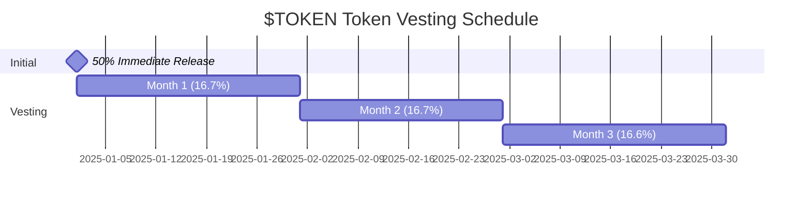

At the end of GOCHI's pre-launch phase, your accumulated points will be converted to $TOKEN tokens based on your share of the total points pool. This page explains the conversion process, allocation formula, and vesting schedule.

## Conversion Timeline

<Steps>
  <Step title="Final Points Snapshot">
    24 hours before token launch, a final snapshot of all player points will be taken. This snapshot will be used for conversion calculations.
  </Step>
  <Step title="Allocation Calculation">
    Each player's token allocation will be calculated based on their percentage of the total points pool.
  </Step>
  <Step title="Token Distribution">
    At launch, 50% of allocated tokens will be immediately distributed to qualified wallets. The remaining 50% will be vested over 3 months.
  </Step>
  <Step title="System Transition">
    The points system will be retired, and the token-based economy will begin operation.
  </Step>
</Steps>

## Allocation Formula

Your $TOKEN token allocation is calculated using this formula:

```
IndividualTokenAllocation = (YourPoints ÷ TotalPointsPool) × TokenAllocationPool
```

Where:
- `YourPoints` is your final points balance at snapshot
- `TotalPointsPool` is the sum of all players' points
- `TokenAllocationPool` is 150,000,000 $TOKEN (15% of total supply)

## Allocation Example

<AccordionGroup>
  <Accordion title="Basic Example">
    If the total points across all users is 10,000,000:
    
    **A player with 10,000 points would receive:**
    
    (10,000 ÷ 10,000,000) × 150,000,000 = 150,000 $TOKEN tokens
    
    **A player with 5,000 points would receive:**
    
    (5,000 ÷ 10,000,000) × 150,000,000 = 75,000 $TOKEN tokens
  </Accordion>
  
  <Accordion title="Maximum Cap Example">
    A player who reached the maximum 20,000 points cap:
    
    (20,000 ÷ 10,000,000) × 150,000,000 = 300,000 $TOKEN tokens
    
    However, this would be subject to the maximum allocation cap of 500,000 $TOKEN.
  </Accordion>
</AccordionGroup>

## Allocation Protections

To ensure fair distribution, several protections are in place:

<CardGroup cols={2}>
  <Card title="Minimum Allocation" icon="shield-check">
    Any user with at least 100 points receives a minimum of 1,000 $TOKEN tokens, ensuring even casual participants receive a meaningful allocation.
  </Card>
  <Card title="Maximum Allocation" icon="shield-halved">
    No single account can receive more than 500,000 $TOKEN tokens (0.05% of total supply), preventing excessive concentration.
  </Card>
</CardGroup>

| Protection Type | Threshold | Effect |
|-----------------|-----------|--------|
| Minimum Allocation | 100+ points | Guarantees 1,000 $TOKEN |
| Maximum Allocation | Formula result > 500,000 | Caps at 500,000 $TOKEN |
| Activity Requirement | Activity in final week | Required for conversion |

<Note>
The minimum allocation ensures that early supporters receive meaningful participation in the ecosystem, while the maximum allocation prevents excessive concentration and promotes fairness.
</Note>

## Vesting Schedule

Token allocations follow a partial vesting schedule to ensure ecosystem stability:



<Table>
  <Thead>
    <Tr>
      <Th>Period</Th>
      <Th>Percentage</Th>
      <Th>For 150,000 $TOKEN Example</Th>
    </Tr>
  </Thead>
  <Tbody>
    <Tr>
      <Td>Launch Day</Td>
      <Td>50%</Td>
      <Td>75,000 $TOKEN</Td>
    </Tr>
    <Tr>
      <Td>End of Month 1</Td>
      <Td>16.7%</Td>
      <Td>25,050 $TOKEN</Td>
    </Tr>
    <Tr>
      <Td>End of Month 2</Td>
      <Td>16.7%</Td>
      <Td>25,050 $TOKEN</Td>
    </Tr>
    <Tr>
      <Td>End of Month 3</Td>
      <Td>16.6%</Td>
      <Td>24,900 $TOKEN</Td>
    </Tr>
  </Tbody>
</Table>

<Warning>
The vesting schedule is non-negotiable and applies to all participants. This approach helps maintain token price stability in the critical early stages of the project.
</Warning>

## Activity Requirement

To qualify for points conversion, accounts must demonstrate active engagement with their GOCHI pet during the final week before the snapshot:

- Minimum average stat level of 40% across all attributes
- At least one interaction within 48 hours of the snapshot
- No evidence of automated or exploitative behavior

<Note>
These requirements ensure that token allocations go to genuinely engaged community members rather than inactive or abandoned accounts.
</Note>

## Verification Process

<AccordionGroup>
  <Accordion title="Snapshot Verification">
    The final points snapshot will be cryptographically verified and published publicly, ensuring complete transparency in the conversion process.
  </Accordion>
  
  <Accordion title="Allocation Calculation">
    The allocation calculation will be performed by a smart contract with the formula and inputs published publicly for verification.
  </Accordion>
  
  <Accordion title="Token Distribution">
    All token distributions will occur through verifiable on-chain transactions, with transaction hashes published for transparency.
  </Accordion>
</AccordionGroup>

<Tip>
You can maximize your token allocation by focusing on consistent, high-quality care during the entire pre-launch phase, particularly in the final weeks leading up to the snapshot.
</Tip>