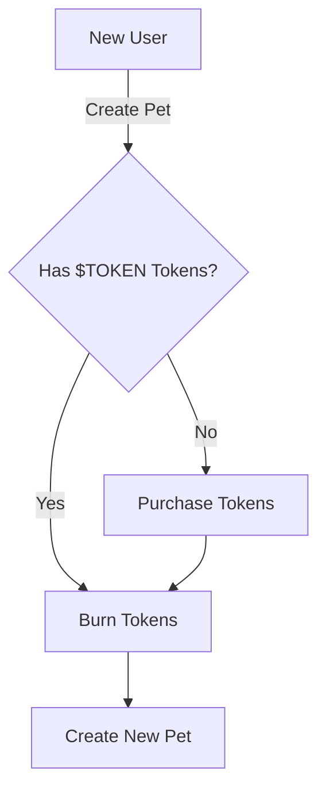

The transition from GOCHI's pre-launch phase to the full token ecosystem is a critical period that introduces significant changes to the platform's economy and reward mechanisms. This guide explains what happens during and after the transition.

## Economic System Changes

<CardGroup cols={2}>
  <Card title="Pre-Launch System" icon="clock-rotate-left">
    - Points accumulation based on care quality
    - No real-time rewards or monetary value
    - Points represent future token allocation
    - Focus on building engagement and community
  </Card>
  <Card title="Post-Launch System" icon="rocket">
    - Direct SOL rewards based on care quality
    - 8% tax on token transactions funds rewards
    - Token holding multipliers boost earnings
    - Real-time economic value for gameplay
  </Card>
</CardGroup>

## Points to Token Conversion

At launch, your accumulated points convert to $TOKEN tokens according to the allocation formula:

```
IndividualTokenAllocation = (YourPoints ÷ TotalPointsPool) × 150,000,000 $TOKEN
```

<Note>
This conversion happens only once at launch. After the transition, points are no longer used or accumulated in the system. All future rewards are distributed in SOL.
</Note>

## Token Allocation Distribution

<AccordionGroup>
  <Accordion title="Initial Release (50%)">
    Half of your calculated token allocation is distributed immediately at launch, allowing you to:
    
    - Begin participating in the token economy
    - Establish your holding multiplier tier
    - Trade tokens if desired
    - Access premium features
  </Accordion>
  
  <Accordion title="Vested Release (50%)">
    The remaining half of your allocation is distributed over a 3-month period:
    
    - Month 1: 16.7% of total allocation
    - Month 2: 16.7% of total allocation
    - Month 3: 16.6% of total allocation
    
    This gradual release helps maintain token price stability during the critical early stage.
  </Accordion>
</AccordionGroup>

## SOL Rewards Activation

<CardGroup cols={3}>
  <Card title="Funding Source" icon="money-bill-transfer">
    5% of all $TOKEN token transaction taxes fund the reward pool
  </Card>
  <Card title="Distribution Cycle" icon="clock">
    Rewards calculated and distributed hourly
  </Card>
  <Card title="Calculation Basis" icon="calculator">
    Care Quality × Holding Multiplier determines share
  </Card>
</CardGroup>

The SOL reward system activates approximately 48 hours after token launch, allowing sufficient time for:

- Initial trading volume to generate the reward pool
- Players to establish their token holding positions
- The system to calibrate to the new economic model
- Proper testing of the automated distribution mechanism

## Gameplay Changes

<Table>
  <thead>
    <tr>
      <th>Feature</th>
      <th>Pre-Launch</th>
      <th>Post-Launch</th>
    </tr>
  </thead>
  <tbody>
    <tr>
      <td>Pet Care Mechanics</td>
      <td>Core gameplay established</td>
      <td>Remains unchanged</td>
    </tr>
    <tr>
      <td>Rewards</td>
      <td>Points (future value)</td>
      <td>SOL (immediate value)</td>
    </tr>
    <tr>
      <td>Premium Features</td>
      <td>Limited availability</td>
      <td>Full access with $TOKEN</td>
    </tr>
    <tr>
      <td>Earning Multipliers</td>
      <td>Care quality only</td>
      <td>Care quality + token holdings</td>
    </tr>
    <tr>
      <td>Leaderboards</td>
      <td>Points-based ranking</td>
      <td>Earnings-based ranking</td>
    </tr>
  </tbody>
</Table>

<Note>
The core gameplay experience remains consistent through the transition. Your pet still requires the same care and attention, but the reward mechanism changes from future-value points to immediate-value SOL.
</Note>

## New Pet Creation

After launch, creating new pets requires $TOKEN tokens:



<CardGroup cols={2}>
  <Card title="Creation Requirement" icon="paw">
    Creating a new pet requires burning a specified amount of $TOKEN tokens:
    
    - Initial cost: 5,000 $TOKEN
    - Cost may increase over time
    - Adds deflationary pressure
  </Card>
  
  <Card title="Pre-Launch Exemption" icon="ticket">
    Players who participated in the pre-launch phase:
    
    - Keep their existing pets
    - No token requirement for their original pet
    - Still subject to creation cost for additional pets
  </Card>
</CardGroup>

## User Experience During Transition

<AccordionGroup>
  <Accordion title="Interface Updates">
    The GOCHI interface will update automatically during the transition:
    
    - Points display replaced by token holdings and SOL earnings
    - New section for token vesting schedule
    - Updated dashboard with earnings metrics
    - Added token holding multiplier indicator
  </Accordion>
  
  <Accordion title="Notification System">
    You will receive notifications throughout the transition process:
    
    - Pre-transition reminder (72 hours before snapshot)
    - Snapshot confirmation
    - Token allocation notification
    - First SOL reward notification
  </Accordion>
</AccordionGroup>

<Warning>
During the transition period (especially the 48 hours between token launch and reward activation), some features may be temporarily limited or unavailable as systems are upgraded.
</Warning>

## Preparing for the Transition

To maximize your benefits during the transition:

<Steps>
  <Step title="Maximize Points">
    Focus on consistent, high-quality care in the final weeks before the snapshot to accumulate as many points as possible.
  </Step>
  <Step title="Prepare Wallet">
    Ensure your connected wallet is properly configured to receive $TOKEN tokens and SOL rewards.
  </Step>
  <Step title="Develop Token Strategy">
    Decide in advance whether you'll hold tokens for multiplier benefits or trade some portion after receiving your allocation.
  </Step>
  <Step title="Stay Informed">
    Follow official GOCHI communication channels for important updates and exact timing of transition events.
  </Step>
</Steps>

<Tip>
The transition presents a unique opportunity to establish a strong position in the GOCHI ecosystem. Players who understand and prepare for these changes will gain significant advantages in the post-launch economy.
</Tip>