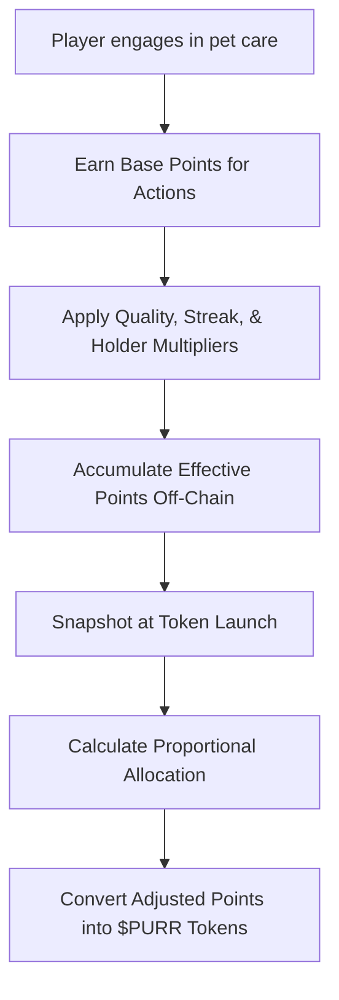

Before **$PURR tokens** are officially launched, **GOCHI** operates on a **points-based system** that tracks your engagement and care quality. Your accumulated points represent your future share of the $PURR token airdrop when the project officially launches.

> **Note:** Points serve as your claim ticket for the initial $PURR token distribution. They are tracked off-chain and later converted proportionally into tokens based on your performance.

## How Points Work

<CardGroup cols={2}>
  <Card title="Points Purpose" icon="bullseye">
    Points record your early contribution and engagement with GOCHI.  
    They determine your share of the initial token allocation.
  </Card>
  <Card title="Points vs. Tokens" icon="scale-balanced">
    Unlike tokens, points:
    
    - Cannot be transferred between accounts  
    - Have no monetary value until conversion  
    - Exist solely within the GOCHI platform  
    - Are not tradable on exchanges
  </Card>
</CardGroup>

## Points Generation Mechanics

Players earn points through pet care, with an AI evaluation considering:

- Pet state quality (health, happiness, hunger, cleanliness)
- Interaction frequency and consistency
- Activity diversity and appropriateness

### Base Point Calculation

A player earns base points for every activity. For example, typical base points per hour:

| Activity   | Base Points (per Hour) | Condition                              |
|------------|------------------------|----------------------------------------|
| Feeding    | 100                    | When the pet is in a normal state      |
| Playing    | 80                     | Adjusted based on pet mood             |
| Cleaning   | 60                     | When cleanliness is below threshold    |

Below is pseudocode illustrating the hourly point calculation:

```javascript
// Calculate hourly points based on pet care activity
function calculateHourlyPoints(pet, player) {
  const baseRate = 10; // Base points per hour
  const qualityMultiplier = calculateQualityMultiplier(pet); // Ranges from 0.5 to 3.0 based on pet stats
  const streakMultiplier = 1.0 + Math.min(player.consecutiveDays * 0.05, 0.5); // Caps at 1.5
  return baseRate * qualityMultiplier * streakMultiplier;
}

function calculateQualityMultiplier(pet) {
  const avgStats = (pet.hunger + pet.happiness + pet.cleanliness + pet.energy) / 4;
  if (avgStats >= 90) return 3.0;
  else if (avgStats >= 70) return 2.0;
  else if (avgStats >= 50) return 1.0;
  else if (avgStats >= 30) return 0.5;
  else return 0.2;
}
```

### Multipliers

#### Quality Multiplier
- **Excellent Care:** 3.0× (Average stats ≥ 90)
- **Good Care:** 2.0× (Average stats ≥ 70)
- **Average Care:** 1.0× (Average stats ≥ 50)

#### Streak Multiplier
Calculated as:  
```
StreakMultiplier = 1.0 + (ConsecutiveDays × 0.05)   // Capped at 1.5
```

| Consecutive Days | Streak Multiplier | Increase in Points |
|------------------|-------------------|--------------------|
| 1                | 1.05×             | +5%                |
| 5                | 1.25×             | +25%               |
| 10+              | 1.5×              | +50% (maximum)     |

#### Token Holder Multiplier

For players holding early $PURR tokens, the multiplier is calculated as:

```javascript
// Holder Multiplier Formula
function calculateHolderMultiplier(tokenBalance) {
  return Math.min(0.2 + Math.pow((tokenBalance / 10000), 0.7), 8.0);
}
```

> **Tip:** Non-holders (0 tokens) receive a baseline multiplier of 0.2×, while holding 10,000 $PURR brings you approximately to 1.0×, with a maximum cap at 8.0×.

### Effective Points Calculation

The total effective points for each activity is:

```
EffectivePoints = BasePoints × QualityMultiplier × StreakMultiplier × HolderMultiplier
```

*Example:*  
If feeding gives 100 base points, with a quality multiplier of 1.5, a streak multiplier of 1.2, and a holder multiplier of 1.5, then:  
```
EffectivePoints = 100 × 1.5 × 1.2 × 1.5 = 270 points
```

## Pre-Launch Farming Limitations

To prevent abuse, limits are set on how many points can be earned.

### Daily Points Cap

```javascript
// Calculate daily points cap for a player
function calculateDailyPointsCap(player) {
  const baseCap = 200;
  const increase = Math.min(player.daysActive * 20, 300);
  return Math.min(baseCap + increase, 500);
}
```

<AccordionGroup>
  <Accordion title="Daily Cap Progression">
  
| Active Days | Daily Cap | Explanation                    |
|-------------|-----------|--------------------------------|
| 1           | 200       | Base cap for new players       |
| 5           | 300       | 200 + (5 × 20) = 300           |
| 10          | 400       | 200 + (10 × 20) = 400          |
| 15+         | 500       | Maximum daily cap              |

  </Accordion>
  <Accordion title="Daily Cap Example">
    For a player with a base rate of 10 points/hour, quality multiplier of 3.0, and a streak multiplier of 1.5:
    
    - Calculated hourly = 10 × 3.0 × 1.5 = 45 points/hour  
    - Potential 24-hour points = 45 × 24 = 1,080 points  
    - However, the daily cap limits earnings to 400 points.
  </Accordion>
</AccordionGroup>

### Total Pre-Launch Points Cap

The maximum total points a player can earn is determined by:

```
TotalPointsCap = 10,000 + (ReferralsCount × 500), with a maximum of 20,000 points
```

> **Note:** Once you reach this total cap, further activities will not increase your point total; however, care quality continues to affect pet development and future token allocation.

## Points Tracking Dashboard

<Frame>
  
</Frame>

The dashboard shows:
- Current points balance
- Points earned today
- Progress toward daily and total caps
- Your earning rate and leaderboard position

> **Warning:** Points and rates are audited before the final snapshot. Any detected abuse can lead to point adjustments or invalidation.

## Referral Program

Referrals boost your performance by:
- Increasing your point earning rate by 5% per referral (up to a +50% bonus)
- Raising your total points cap by 500 per referral (up to a +5,000 bonus)

<CardGroup cols={2}>
  <Card title="Referral Process" icon="share-nodes">
    Share your unique referral link. New players must:
    1. Create a GOCHI account  
    2. Connect their wallet  
    3. Keep their pet active for at least 3 days
  </Card>
  <Card title="Milestone Rewards" icon="gift">
    Referral milestones unlock bonuses:
    - 3 referrals: Unique pet accessory  
    - 5 referrals: Rare pet background  
    - 10 referrals: Exclusive pet variant
  </Card>
</CardGroup>

## Token Conversion

When GOCHI launches, your points will convert into $PURR tokens according to:

```
Individual Token Allocation = (Individual Points ÷ Total Points Pool) × 150,000,000
```

### Allocation Protections
- **Minimum:** Accounts with ≥100 points receive at least 1,000 $PURR tokens.
- **Maximum:** No account receives more than 500,000 $PURR tokens.

### Bonus Allocations

<CardGroup cols={2}>
  <Card title="Leaderboard Bonuses" icon="ranking-star">
    - Top 10: +20% bonus  
    - Top 100: +15% bonus  
    - Top 500: +10% bonus  
    - Top 1,000: +5% bonus
  </Card>
  <Card title="Early Adopter Bonuses" icon="hourglass-start">
    - Participants in Week 1-2: +20% bonus  
    - Participants in Week 3-4: +10% bonus  
    - Week 5+: Standard allocation
  </Card>
</CardGroup>

## Process Flow



## Pseudocode for Conversion

```plaintext
For each player:
    basePoints = points from care activities
    effectivePoints = basePoints × qualityMultiplier × streakBonus × holderMultiplier
    totalEffectivePoints += effectivePoints

At token launch:
    For each player:
        UserTokenAllocation = (playerEffectivePoints / totalEffectivePoints) × TotalAirdropPool
        // With safety adjustments:
        AdjustedUserPoints = playerEffectivePoints × 0.8
        AdjustedTotalPoints = totalEffectivePoints × 1.1
        FinalAllocation = (AdjustedUserPoints / AdjustedTotalPoints) × TotalAirdropPool
```

## Key Considerations & Safeguards

<AccordionGroup>
  <Accordion title="Exploitation Prevention">
    Limit maximum daily point gains and enforce one pet per wallet to prevent abuse.
  </Accordion>
  <Accordion title="Safety Adjustments">
    The factors 0.8 (user) and 1.1 (total) act as buffers during conversion to protect the treasury.
  </Accordion>
  <Accordion title="Dynamic Scaling">
    Regular snapshots capture accurate engagement, and dynamic adjustments ensure fairness as the community grows.
  </Accordion>
</AccordionGroup>

