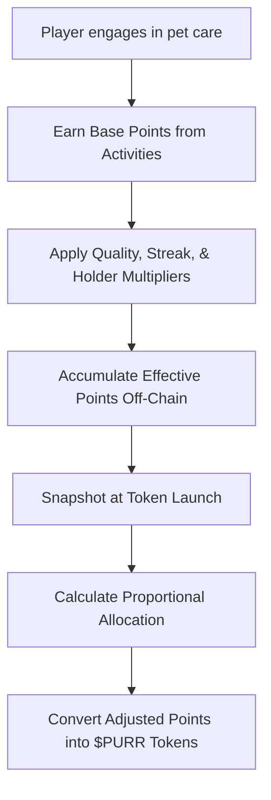

# Pre-Launch Points System

Before **$PURR tokens** are officially launched, **GOCHI** operates on a **points-based system** that tracks your engagement and care quality. The points you earn now will determine your future share of the $PURR token airdrop when GOCHI goes live.

> **Note:** Points are earned off-chain based on your care activities and will later be converted into a proportional token allocation during the launch.

---

## How Points Work

<CardGroup cols={2}>
  <Card title="Purpose of Points" icon="bullseye">
    Points record your early contributions and engagement, acting as your claim ticket for the $PURR token airdrop.
  </Card>
  <Card title="Points vs. Tokens" icon="scale">
    Points are:
    - Non-transferable  
    - Not directly tradable  
    - Valued only at conversion time  
    - Used exclusively within the GOCHI ecosystem
  </Card>
</CardGroup>

---

## Points Generation Mechanics

Players earn points by caring for their pet. The system evaluates:

- **Pet Quality:** Health, happiness, hunger, and cleanliness  
- **Engagement Frequency:** How consistently you interact with your pet  
- **Activity Variety:** The diversity and appropriateness of care actions

### Base Point Calculation

Each pet care activity earns a set number of base points. For example, per hour:

| **Activity** | **Base Points** | **Condition**                              |
|--------------|-----------------|--------------------------------------------|
| Feeding      | 100             | When pet is in a normal state              |
| Playing      | 80              | Adjusted based on pet mood                 |
| Cleaning     | 60              | When pet’s cleanliness is below threshold  |

Below is pseudocode illustrating the hourly calculation:

```javascript
// Calculate hourly points based on pet care activities
function calculateHourlyPoints(pet, player) {
  const baseRate = 10; // Base points per hour
  const qualityMultiplier = calculateQualityMultiplier(pet); // 0.5 to 3.0
  const streakMultiplier = 1.0 + Math.min(player.consecutiveDays * 0.05, 0.5); // Max 1.5
  return baseRate * qualityMultiplier * streakMultiplier;
}

function calculateQualityMultiplier(pet) {
  const avgStats = (pet.hunger + pet.happiness + pet.cleanliness + pet.energy) / 4;
  if (avgStats >= 90) return 3.0;
  else if (avgStats >= 70) return 2.0;
  else if (avgStats >= 50) return 1.0;
  else if (avgStats >= 30) return 0.5;
  else return 0.2;
}
```

### Multipliers

#### Quality Multiplier
- **Excellent Care:** 3.0× (avg stats ≥ 90)  
- **Good Care:** 2.0× (avg stats ≥ 70)  
- **Average Care:** 1.0× (avg stats ≥ 50)

#### Streak Multiplier

Daily consistency is rewarded. The streak multiplier is calculated as:

```
StreakMultiplier = 1.0 + (ConsecutiveDays × 0.05)  // Maximum value: 1.5×
```

| Consecutive Days | Streak Multiplier | Increase in Points  |
|------------------|-------------------|---------------------|
| 1                | 1.05×             | +5%                 |
| 5                | 1.25×             | +25%                |
| 10+              | 1.5×              | +50% (max)          |

#### Token Holder Multiplier

Players who hold $PURR tokens early receive a bonus:

```javascript
// Holder Multiplier Formula
function calculateHolderMultiplier(tokenBalance) {
  return Math.min(0.2 + Math.pow((tokenBalance / 10000), 0.7), 8.0);
}
```

> **Tip:** Non-holders start at 0.2×; holding 10,000 $PURR roughly gives a 1.0× multiplier, capping at 8.0×.

### Effective Points

The total effective points per activity are calculated by:

```
EffectivePoints = BasePoints × QualityMultiplier × StreakMultiplier × HolderMultiplier
```

*Example:*  
A feeding action with:  
- Base: 100 points  
- Quality Multiplier: 1.5  
- Streak Multiplier: 1.2  
- Holder Multiplier: 1.5  
Results in:  
```
EffectivePoints = 100 × 1.5 × 1.2 × 1.5 = 270 points
```

---

## Farming Limitations

To ensure fairness, the system enforces daily and total point caps.

### Daily Points Cap

```javascript
// Daily points cap calculation
function calculateDailyPointsCap(player) {
  const baseCap = 200;
  const dailyIncrease = Math.min(player.daysActive * 20, 300);
  return Math.min(baseCap + dailyIncrease, 500); // Maximum 500 points per day
}
```

<AccordionGroup>
  <Accordion title="Daily Cap Progression">
| Active Days | Daily Cap | Explanation                 |
|-------------|-----------|-----------------------------|
| 1           | 200       | Base cap for new players    |
| 5           | 300       | 200 + (5 × 20) = 300        |
| 10          | 400       | 200 + (10 × 20) = 400       |
| 15+         | 500       | Maximum daily cap           |
  </Accordion>
  <Accordion title="Daily Cap Example">
A player with a calculated rate of 45 points/hour could potentially earn 1,080 points in 24 hours, but the daily cap limits this to 400 points.
  </Accordion>
</AccordionGroup>

### Total Points Cap

```
TotalPointsCap = 10,000 + (ReferralsCount × 500), capped at 20,000 points
```

> **Note:** Once you hit this cap, further care does not increase your total points, though your pet continues to develop.

---

## Points Tracking Dashboard

<Frame>
  
</Frame>

Your dashboard displays:
- **Current Points Balance**
- **Points Earned Today**
- **Progress Toward Daily and Total Caps**
- **Earning Rate and Leaderboard Position**

> **Warning:** Points and rates are audited before the final snapshot; any anomalies may result in adjustments.

---

## Referral Program

Referrals help boost your overall performance by:
- **Increasing your point rate** by 5% per referral (up to +50%)
- **Raising your total points cap** by 500 per referral (up to an extra 5,000 points)

<CardGroup cols={2}>
  <Card title="Referral Process" icon="share-nodes">
    Share your unique referral link. New players must:
    1. Create a GOCHI account  
    2. Connect their wallet  
    3. Keep their pet active for at least 3 days
  </Card>
  <Card title="Milestone Rewards" icon="gift">
    Referral milestones unlock bonuses:
    - 3 referrals: Unique pet accessory  
    - 5 referrals: Rare pet background  
    - 10 referrals: Exclusive pet variant
  </Card>
</CardGroup>

---

## Token Conversion

At launch, your points will convert into $PURR tokens based on your share of the total points:

```
Individual Token Allocation = (Individual Points ÷ Total Points Pool) × 150,000,000
```

### Allocation Rules

- **Minimum Allocation:** Accounts with at least 100 points receive at least 1,000 $PURR tokens.
- **Maximum Allocation:** No account receives more than 500,000 $PURR tokens.

### Bonus Allocations

<CardGroup cols={2}>
  <Card title="Leaderboard Bonuses" icon="ranking-star">
    - Top 10: +20% bonus  
    - Top 100: +15% bonus  
    - Top 500: +10% bonus  
    - Top 1,000: +5% bonus
  </Card>
  <Card title="Early Adopter Bonuses" icon="hourglass-start">
    - Week 1-2 participants: +20% bonus  
    - Week 3-4 participants: +10% bonus  
    - Week 5+ participants: Standard allocation
  </Card>
</CardGroup>

---

## Process Flow



## Pseudocode for Conversion

```plaintext
For each player:
  basePoints = points earned from care activities
  effectivePoints = basePoints × qualityMultiplier × streakBonus × holderMultiplier
  totalEffectivePoints += effectivePoints

At token launch:
  For each player:
    UserTokenAllocation = (playerEffectivePoints / totalEffectivePoints) × TotalAirdropPool
    // Apply safety adjustments:
    AdjustedUserPoints = playerEffectivePoints × 0.8
    AdjustedTotalPoints = totalEffectivePoints × 1.1
    FinalAllocation = (AdjustedUserPoints / AdjustedTotalPoints) × TotalAirdropPool
```

---