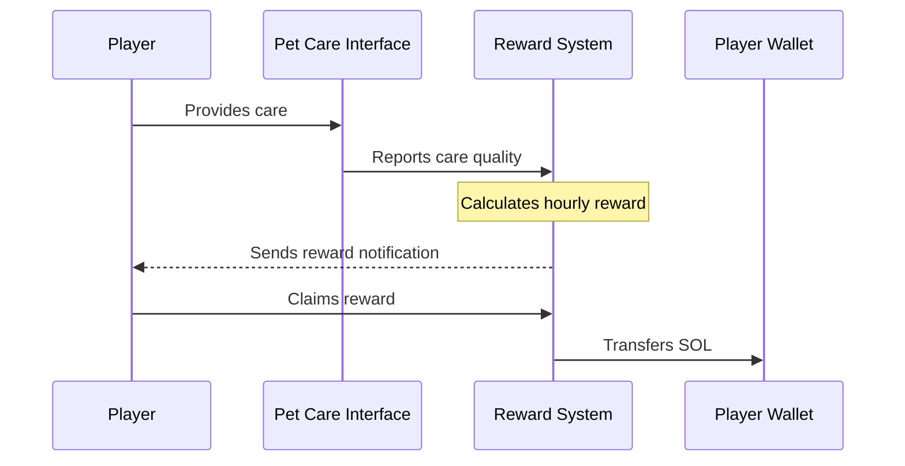

Unlike many projects that distribute rewards daily or weekly, GOCHI operates on an hourly distribution cycle to maximize engagement and provide immediate feedback on care quality.

## Hourly Distribution Cycle



<Steps>
  <Step title="Reward Pool Calculation">
    At the beginning of each hour, the system calculates the hourly reward pool:
    
    ```
    HourlyRewardPool = DailyVolume × 0.05 ÷ 24
    ```
    
    For example, with $5M daily volume:
    $5,000,000 × 0.05 ÷ 24 = $10,416 per hour
  </Step>
  
  <Step title="Individual Share Calculation">
    Each player's share is determined by their Care Quality Score and Holding Multiplier:
    
    ```
    UserShare = (UserWeightedPoints ÷ TotalWeightedPoints) × HourlyRewardPool
    ```
    
    Where:
    - UserWeightedPoints = UserCareQualityScore × UserHoldingMultiplier
    - TotalWeightedPoints = Sum of all active users' weighted points
  </Step>
  
  <Step title="Notification">
    When rewards are available, you receive an in-app notification
  </Step>
  
  <Step title="Claiming Process">
    Claim your rewards with a single tap
    Rewards are sent directly to your connected wallet
    Unclaimed rewards accumulate until collected
  </Step>
</Steps>

## Dynamic Adjustment System

GOCHI's reward system includes dynamic adjustments to ensure sustainability across different market conditions:

<CardGroup cols={2}>
  <Card title="Volume-Based Scaling" icon="chart-line">
    As trading volume increases, the reward pool grows proportionally, ensuring larger rewards during high activity periods.
    
    During low volume periods, rewards decrease but maintain reasonable minimum levels.
  </Card>
  
  <Card title="Player Participation Adjustment" icon="users">
    The system adjusts to player counts, ensuring fair distribution whether there are 1,000 or 100,000 active players.
    
    This prevents dilution of rewards as the player base grows.
  </Card>
</CardGroup>

## Reward Claiming Best Practices

<AccordionGroup>
  <Accordion title="Optimal Claiming Frequency">
    While rewards are distributed hourly, you don't need to claim every hour. Consider these approaches:
    
    - **Power Users:** Claim 2-3 times daily during active periods
    - **Daily Players:** Claim once daily to minimize transaction friction
    - **Casual Players:** Claim weekly to accumulate meaningful amounts
    
    There is no expiration on unclaimed rewards, so you can develop a claiming schedule that works for you.
  </Accordion>
  
  <Accordion title="Gas Optimization">
    Each claim transaction requires a small amount of SOL for gas fees. To optimize:
    
    - Consider claiming during periods of lower network congestion
    - Batch your claims rather than claiming very small amounts frequently
    - The system is designed to ensure claim fees never exceed the reward value
  </Accordion>
</AccordionGroup>

<Tip>
The hourly reward cycle creates a powerful "dopamine loop" that encourages frequent engagement. Each time you care for your pet, you not only improve its wellbeing but also see the direct impact on your earnings in near real-time.
</Tip>