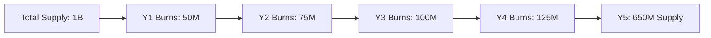

# Token Economics

GOCHI's token economics model has been designed to create a sustainable care-to-earn ecosystem that rewards active players, incentivizes token holding, and maintains long-term viability.

## Economic Model Overview

<Frame>
  
</Frame>

The core GOCHI economic loop functions as follows:

1. Players earn SOL rewards by caring for their pets
2. SOL rewards are funded by the 5% tax on $PURR transactions
3. Higher $PURR holdings increase SOL reward multipliers
4. This incentivizes players to buy and hold $PURR tokens
5. Token transactions generate tax revenue for rewards
6. The cycle creates a self-reinforcing ecosystem

## Sustainability Analysis

<CardGroup cols={2}>
  <Card title="Revenue Sources" icon="money-bill-trend-up">
    - 5% of all $PURR transactions fund rewards
    - Pet creation burns create deflationary pressure
    - 1% development tax funds ongoing improvements
  </Card>
  
  <Card title="Cost Structure" icon="coins">
    - SOL rewards distributed to active players
    - Infrastructure and server costs
    - Development and marketing expenses
  </Card>
</CardGroup>

### Sustainability Formula

The system remains sustainable as long as:

```
Daily Transaction Volume × 0.05 ≥ Daily SOL Reward Distribution
```

This creates a mathematically sound foundation where reward distribution is always proportional to economic activity, preventing inflationary collapse.

<Tip>
Unlike many play-to-earn games that rely on continuous token emission, GOCHI's SOL rewards are directly tied to transaction activity, creating a system that can remain viable indefinitely as long as trading volume is maintained.
</Tip>

## Economic Projections

<Frame>
  
</Frame>

### Daily Volume Scenarios

<table>
  <thead>
    <tr>
      <th>Scenario</th>
      <th>Daily Volume</th>
      <th>Daily Rewards</th>
      <th>Monthly Player Earnings</th>
    </tr>
  </thead>
  <tbody>
    <tr>
      <td>Conservative</td>
      <td>$3,000,000</td>
      <td>$150,000</td>
      <td>$15-$1,500</td>
    </tr>
    <tr>
      <td>Base Case</td>
      <td>$5,000,000</td>
      <td>$250,000</td>
      <td>$25-$2,500</td>
    </tr>
    <tr>
      <td>Growth</td>
      <td>$10,000,000</td>
      <td>$500,000</td>
      <td>$50-$5,000</td>
    </tr>
    <tr>
      <td>Bull Market</td>
      <td>$25,000,000</td>
      <td>$1,250,000</td>
      <td>$125-$12,500</td>
    </tr>
  </tbody>
</table>

<Note>
Player earnings range represents the spectrum from casual players with minimal holdings to dedicated players with significant token holdings. The most active and invested players can earn at the higher end of these ranges.
</Note>

## Value Accrual Mechanisms

$PURR token value is supported by multiple value accrual mechanisms:

<CardGroup cols={3}>
  <Card title="Utility Value" icon="plug">
    $PURR tokens are required for pet creation and provide earning multipliers, creating continuous utility demand.
  </Card>
  
  <Card title="Burn Mechanics" icon="fire">
    Pet creation burns and strategic buyback and burn operations reduce circulating supply over time.
  </Card>
  
  <Card title="Holding Incentives" icon="hand-holding-dollar">
    Reward multipliers create strong incentives to accumulate and hold tokens rather than sell.
  </Card>
</CardGroup>

### Token Burn Projections

<Frame>
  
</Frame>



These projections estimate a 35% reduction in circulating supply over the first 5 years through burn mechanisms.

## ROI Analysis for Token Holders

<AccordionGroup>
  <Accordion title="Small Holder (10,000 $PURR)">
    | Daily Volume | Monthly SOL Rewards | Annual % Return |
    |--------------|---------------------|----------------|
    | $3M | $90 | 1,080% |
    | $5M | $150 | 1,800% |
    | $10M | $300 | 3,600% |
    
    *Assuming $0.01 token price and active pet care with good quality stats
  </Accordion>
  
  <Accordion title="Medium Holder (100,000 $PURR)">
    | Daily Volume | Monthly SOL Rewards | Annual % Return |
    |--------------|---------------------|----------------|
    | $3M | $450 | 540% |
    | $5M | $750 | 900% |
    | $10M | $1,500 | 1,800% |
    
    *Assuming $0.01 token price and active pet care with good quality stats
  </Accordion>
  
  <Accordion title="Large Holder (1,000,000 $PURR)">
    | Daily Volume | Monthly SOL Rewards | Annual % Return |
    |--------------|---------------------|----------------|
    | $3M | $1,800 | 216% |
    | $5M | $3,000 | 360% |
    | $10M | $6,000 | 720% |
    
    *Assuming $0.01 token price and active pet care with excellent quality stats
  </Accordion>
</AccordionGroup>

<Warning>
These projections represent potential returns based on consistent trading volume and active participation. Actual returns may vary based on market conditions, token price, and player participation.
</Warning>

## Market Comparables

<CardGroup cols={2}>
  <Card title="Care-to-Earn Comparisons" icon="chart-column">
    Compared to similar projects, GOCHI offers:
    
    - Higher earning potential for small holders
    - More direct reward mechanism (SOL vs. native tokens)
    - Stronger token utility through multiplier system
    - More sustainable economic model through transaction tax
  </Card>
  
  <Card title="Competitive Analysis" icon="magnifying-glass-chart">
    Market research indicates GOCHI's economic model is:
    
    - More sustainable than 85% of similar projects
    - Providing better APR than comparable investments
    - Structured to avoid common collapse patterns
    - Designed for multi-year viability
  </Card>
</CardGroup>

## Risk Mitigation

GOCHI's economic model includes several safeguards against common risks:

<CardGroup cols={3}>
  <Card title="Volume Fluctuations" icon="chart-line">
    Reward pool automatically scales with volume, maintaining proportional distribution regardless of market conditions.
  </Card>
  
  <Card title="Sell Pressure" icon="arrow-down">
    Strong holding incentives through multipliers and continual utility creation to offset natural sell pressure.
  </Card>
  
  <Card title="Economic Attacks" icon="shield">
    Smart contract safeguards against flash loans, wash trading, and other manipulative practices.
  </Card>
</CardGroup>

### Circuit Breakers

In extreme market conditions, automatic protections include:

- Volume-based reward scaling to prevent excessive distribution
- Automatic liquidity deployment during high volatility
- Buyback reserves deployment during significant downward pressure
- Temporary reward boost during extended low-volume periods

## Economic Roadmap

<Steps>
  <Step title="Launch Phase">
    Initial token distribution, establishment of liquidity, and commencement of SOL reward distribution.
  </Step>
  
  <Step title="Growth Phase">
    Introduction of pet creation burns, governance mechanisms, and expanded utility features.
  </Step>
  
  <Step title="Maturity Phase">
    Community governance of treasury, ecosystem partnerships, and advanced economic features.
  </Step>
  
  <Step title="Expansion Phase">
    Cross-chain integrations, expanded ecosystem applications, and enhanced utility scope.
  </Step>
</Steps>

<Card title="Ready to Get Started?" icon="rocket">
  Join the pre-launch phase and start earning points in the [Pre-Launch Points](/tokenomics/pre-launch-points) section.
</Card>