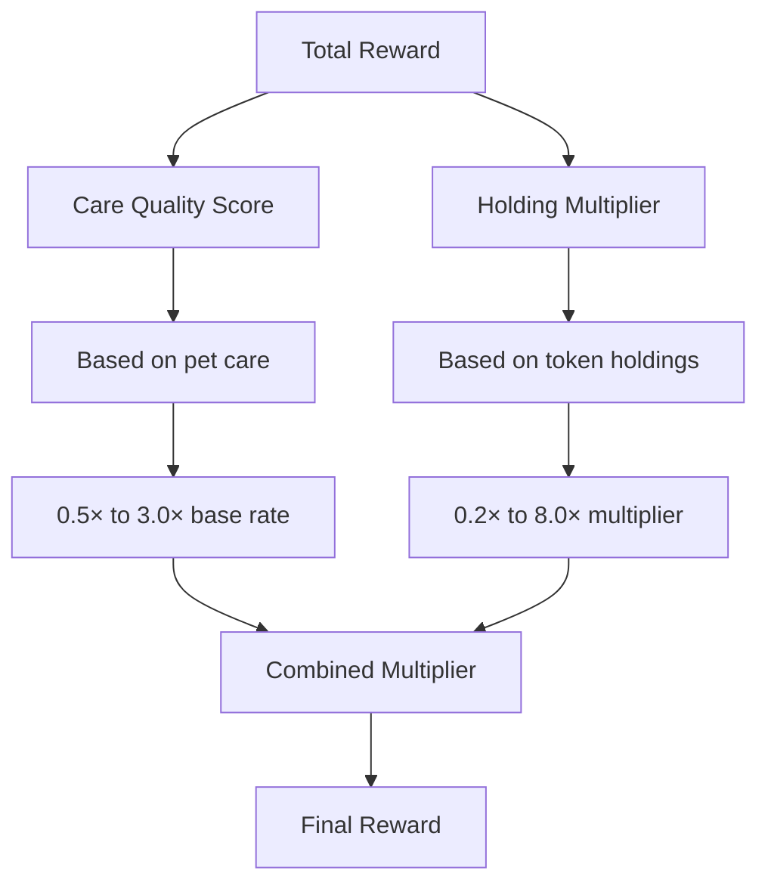

GOCHI's economic model includes significant benefits for token holders, creating a powerful incentive for long-term investment in the ecosystem. By holding $TOKEN tokens, you can dramatically increase your earning potential.

<Warning>
The token ticker is to be announced. <code>$TOKEN</code> is only used as an example.
</Warning>

## Holding Multiplier System

Token holders receive substantial earning bonuses through the Holding Multiplier system:

| Holding Tier | Token Amount | Multiplier | Effect on Rewards |
|--------------|--------------|------------|-------------------|
| Non-holder | 0 $TOKEN | 0.2× | -80% reward penalty |
| Basic Holder | 10,000 $TOKEN | 1.0× | Standard rewards (baseline) |
| Committed Holder | 100,000 $TOKEN | 2.0× | Double rewards |
| Significant Holder | 1,000,000 $TOKEN | 4.0× | Quadruple rewards |
| Whale | 10,000,000+ $TOKEN | 8.0× | Eight times standard rewards |

<Note>
The Holding Multiplier applies to all rewards earned through pet care, creating a powerful compound effect when combined with excellent care quality.
</Note>

## Multiplier Formula

The multiplier is calculated using a power function that creates a balanced curve:

```javascript
// Token Holding Multiplier Formula
function calculateHoldingMultiplier(tokenBalance) {
  return Math.min(0.2 + Math.pow((tokenBalance / 10000), 0.7), 8.0);
}
```

This formula ensures that:

<CardGroup cols={3}>
  <Card title="Incremental Growth" icon="chart-line">
    Every token holding increases rewards
  </Card>
  <Card title="Balanced Scaling" icon="scale-balanced">
    Returns scale significantly with investment
  </Card>
  <Card title="Fair Ceiling" icon="arrow-up-right-dots">
    The system has a reasonable ceiling to prevent extreme advantage
  </Card>
</CardGroup>

## Compound Effect

The holding multiplier creates a compound effect when combined with Care Quality:



This dual multiplier system creates powerful incentives for both active gameplay and token investment.

## Investment Strategies

<AccordionGroup>
  <Accordion title="Balanced Approach">
    **Strategy:** Maintain modest token holdings while focusing on excellent care
    
    **Example:** 10,000 $TOKEN + Excellent Care (3.0×)
    = 1.0 × 3.0 = 3.0× total multiplier
    
    **Best For:** Active players with limited investment capital
    
    **ROI Potential:** ~450% annual (assuming consistent excellent care)
  </Accordion>
  
  <Accordion title="Token-Focused">
    **Strategy:** Prioritize acquiring significant token holdings for multiplier effect
    
    **Example:** 1,000,000 $TOKEN + Average Care (1.0×)
    = 4.0 × 1.0 = 4.0× total multiplier
    
    **Best For:** Investors who play more casually but want significant returns
    
    **ROI Potential:** ~180% annual (with just average care quality)
  </Accordion>
  
  <Accordion title="Maximalist Approach">
    **Strategy:** Combine large token holdings with excellent pet care
    
    **Example:** 1,000,000 $TOKEN + Excellent Care (3.0×)
    = 4.0 × 3.0 = 12.0× total multiplier
    
    **Best For:** Dedicated players willing to make significant investment
    
    **ROI Potential:** ~540% annual (excellent care + significant holding)
  </Accordion>
</AccordionGroup>

## Token Utility Beyond Multipliers

While the holding multiplier is the primary benefit, $PURR tokens have additional utility:

<CardGroup cols={2}>
  <Card title="Premium Features" icon="wand-magic-sparkles">
    **Premium Foods:** Enhance pet stats recovery
    
    **Special Items:** Unlock unique interactions
    
    **Environmental Themes:** Customize your pet's living space
  </Card>
  
  <Card title="Ecosystem Participation" icon="users-gear">
    **Pet Creation:** Required for creating new pets post-launch
    
    **Governance:** Future voting rights on project direction (planned)
    
    **Special Events:** Priority access to limited-time activities
  </Card>
</CardGroup>

<Tip>
Consider reinvesting a portion of your SOL rewards into $PURR tokens to gradually increase your holding multiplier over time. This strategy creates a virtuous cycle of increasing returns.
</Tip>